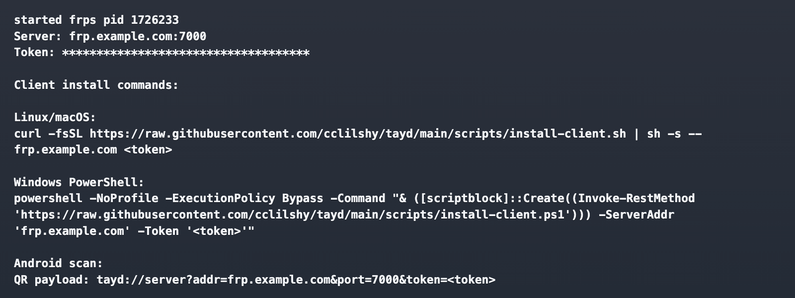
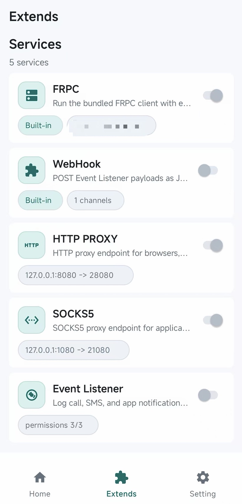

# tayd

一个基于 [frp](https://github.com/fatedier/frp) 开发的本地服务发布工具, 它把 frp 的安装配置生成和服务管理收进一个多端统一的客户端, 适合把本机 Web、TCP 或 UDP 服务发布到自己的公网服务器。

## 快速开始

### 服务端安装

```sh
curl -fsSL https://raw.githubusercontent.com/cclilshy/tayd/main/scripts/install-server.sh | sh
```

自定义hostname

> 当http(s)端口被声明时, 允许多个服务占用服务端http端口, frp会根据host进行路由

```sh
curl -fsSL https://raw.githubusercontent.com/cclilshy/tayd/main/scripts/install-server.sh | sh -s -- <server-hostname> #--http-port 80 --https-port 443
```

服务端安装完成后会打印客户端安装命令



## 基础用法

添加第一个映射

```sh
tayd add web 8080 18080
```

访问

```text
http://<server-hostname>:18080 -> 127.0.0.1:8080
```

## 安卓客户端

Android 客户端在 `frpc` 页面点 `Scan server QR`, 扫描成功后自动完成配置

### 内置模块

<!-- prettier-ignore -->
| 模块 | 用途 |
| --- | --- |
| FRPC | 内置 `frpc` 客户端 |
| WebHook | WebHook channels |
| HTTP PROXY | 本机 HTTP 代理 |
| SOCKS5 | 本机 Socks5 代理 |
| Event Listener | 事件分发 |



## 常用场景

把本机 Web 服务暴露到公网端口

```sh
tayd add web 3000 18080
```

用域名访问本机 HTTP 服务

```sh
tayd add site 3000 http://site.example.com
```

UDP 服务

```sh
tayd add dns udp://5353 5353
```

## 卸载

Unix:

```sh
~/.local/bin/tayd uninstall
```

Windows PowerShell:

```powershell
& "$HOME\.local\bin\tayd.cmd" uninstall
```
